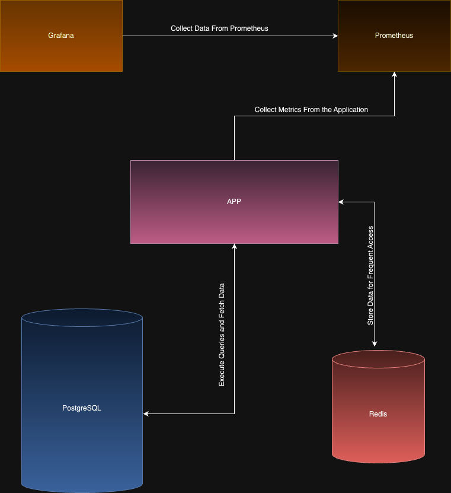

# E-Commerce
This is a simple e-commerce project developed using Golang and the Gin framework, embracing a microservices architecture. The system is composed of three microservices:

1. User Service:
    - Manages user authentication using JWT.
    - Handles user profile retrieval, update, and deletion.
    - Implements basic unit tests for functionality assurance.

2. Product Service:
    - Facilitates CRUD operations for products.
    - Users can only update or delete their created products.
    - Allows users to view product list and detail.
    - Incorporates basic unit tests for quality assurance.

3. Order Service:
    - Manages the creation and deletion of orders.
    - Users can view lists, details of their own orders, and delete their own orders as well.
    - Utilizes basic unit tests for robustness.

## Architecture Overview

Below diagram depict the architecture of each service:

### Microservices:
- Adopts a microservices architecture for modularity and scalability.

### Database Transactions:
- Utilizes database transactions (commit and rollback) and pessimistic locking for effective concurrency control.

### Security Measures:
- Implements JWT authentication for users.
- Employs a Rate Limiter to prevent API exploitation.
- Integrates CORS middleware for secure cross-origin resource sharing.

### Database Communication:
- Utilizes SQLC for generating database schemas.
- Manages database migrations using Goose.

### Inter-Service Communication:
- Makes synchronous calls to other microservices using HTTP RESTful APIs.
- Secures APIs using different secret keys in headers to ensure requests come from within the project.

### Services for Each Microservice:
- **Database:** PostgreSQL for persistent data storage.
- **Redis Cache:** Enhances database performance and stores IPs for the rate limiter service.
- **Monitoring and Alerts:** Utilizes Prometheus and Grafana.

### Containerization:
- Each microservice is Dockerized for easy deployment and management.

### Automation:
- Includes shell scripts to start all services at once and for running test cases.
- GitHub workflow automates unit tests when a pull request is raised to the main/master branch.

## Getting Started
1. Clone the repository

2. Install below softwares/libraries 
    - [Docker](https://www.docker.com/products/docker-desktop/)
    - [Go](https://go.dev/doc/install) (Needed if you want to execute the test cases)
    - [Goose](https://pressly.github.io/goose/installation/) (Needed if you want to execute the test cases)

3. Navigate into the project and run this command `bash run_services.sh`. It'll start all services one-by-one.

4. Access the services using the postman collection: 

### Testing
To run unit tests, You can navigate to the respected service and run this command `bash run_unit_test.sh`

## GitHub Workflow
The project includes a GitHub workflow that automatically runs unit tests when a pull request is raised to the master branch.
